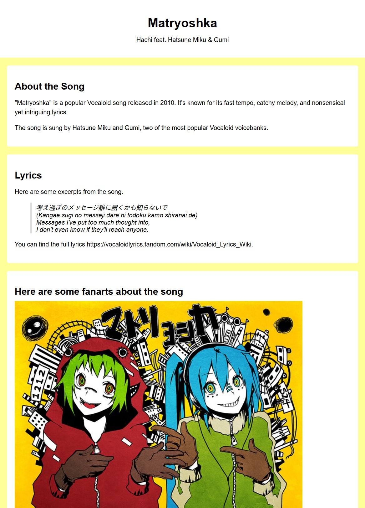
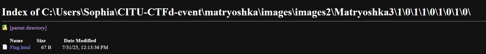

### Matryoshka

Category: Web Exploitation
Solved by: lophiel

## Objective

Find the flag

We're given a website, upon navigating the site nothing inherently obvious is present. Navigating to the sources tab we can see that there is an image folder. By accessing the directory manually, we can navigate through the folders until we eventually find the flag.

FLAG: `CITU{ano_nemotto_ippai_matte_choudai_karinka_marinka_gen_o_hajiite}`
